# Koto

A quasi-distributed ad-free open-source social network

## Introduction

Koto as an open-source, ad-free, social network with a mixture of central and distributed control. Central control provides a common login across all nodes, and prevents bad actors from joining a network. Distribution provides individual ownership, and privacy, for messages, images, and pictures.

Koto is comparable to Facebook, rather than Twitter, as it is for closed circles of friendships.

## Comparison to other social network projects

Koto is unique among [social network sites](https://en.wikipedia.org/wiki/List_of_social_networking_websites) and [projects](https://en.wikipedia.org/wiki/Comparison_of_social_networking_software), which seem to fall into one of four categories:

1. Failed (or failing) startups with no revenue
2. Commercial products that serve ads or charge a fee
3. Distributed OSS projects comparable to Twitter ([Mastadon](https://joinmastodon.org/), [Diaspora](https://diasporafoundation.org/),[Steemit](https://steemit.com/))
4. Centralized OSS projects comparable to Facebook ([Buddy Press](https://buddypress.org/)]

Koto blends these last two categories, offering both a distributed OSS approach, as well as more of a "closed circle" approach like Facebook.

*Note: [Minds](https://www.minds.com/) is a similar blend, but relies on Blockchain, and an incentive model for posting, which seem unnecesary to us.*

## How it works

Facebook is comprised of a [social graph](https://en.wikipedia.org/wiki/Social_graph) representing relationships between different people. Koto attempts to recreate a social graph, giving individuals the ability to accept or ignore friendship requests, and thereby limit the people who can post messages in their timeline. Unlike Facebook, it accomplishes this on distributed nodes, owned and operated by individuals, rather than corporations.

### Example social graph

To understand Koto, let's look at an example social graph.

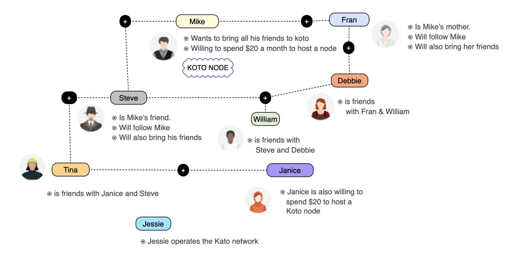

Mike, and Janice, want to start Koto nodes to share thoughts, photos, and videos with their friends. So they create instances on Digital Ocean, or wherever, download the latest release, and run it.

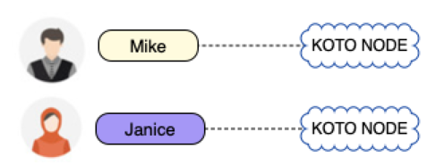

Mike and Janice register their nodes with Jessie, who runs the central node.

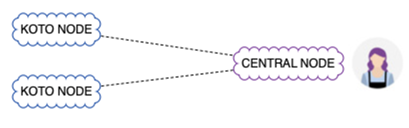

Mike invites his mother Fran, and Steve, to be friends. We'll get to Tina a little later.

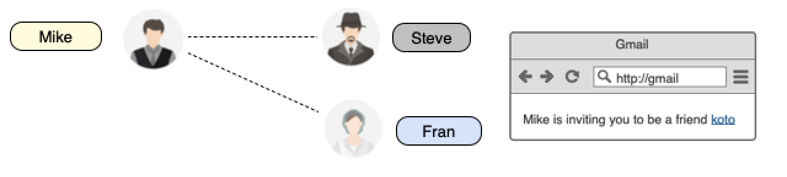

Steve and Fran's accounts are stored at the central server, which also stores friendship information.

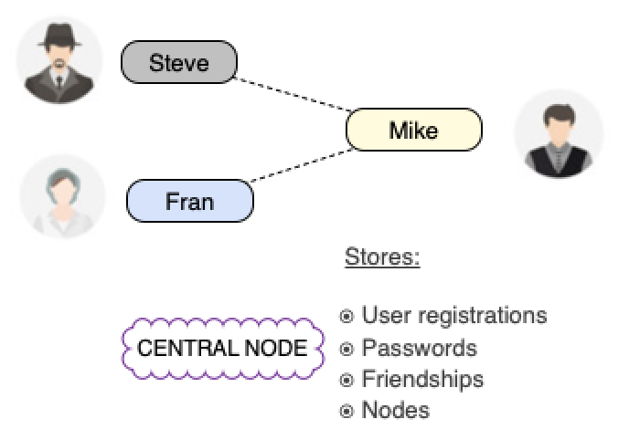

Mike posts a message, with a photo of his cat. This is stored on his node.

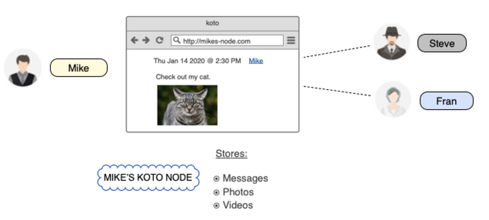

Fran also posts a message, with a photo of her dog. Since she is friends with Mike, he sees the message. But Steve is not friends with Fran, so he doesn't see it. Just like Facebook.

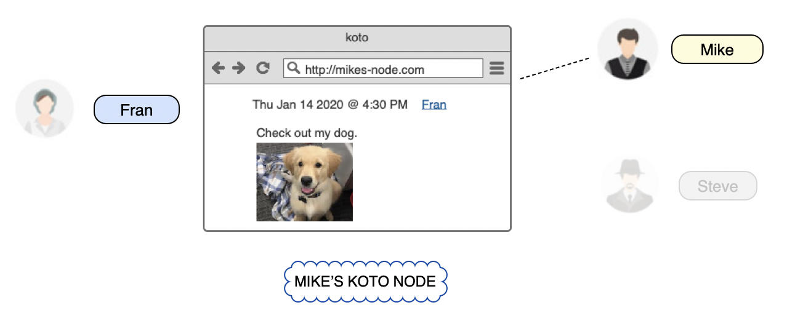

Friends can see lists of their friend's friends. If Fran asks Debbie to be friends, Mike can see they are friends, and invite Debbie to be friends. Debbie doesn't have to accept.

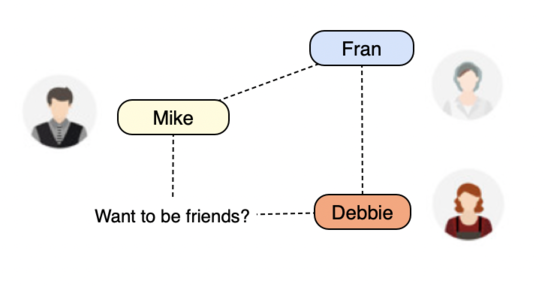

If Debbie becomes friends with William, who is friends with Steve, Mike will see William in Steve's list. Fran also sees William in Debbie's list (like Facebook). We will add privacy features - if you don't want people to discover you.

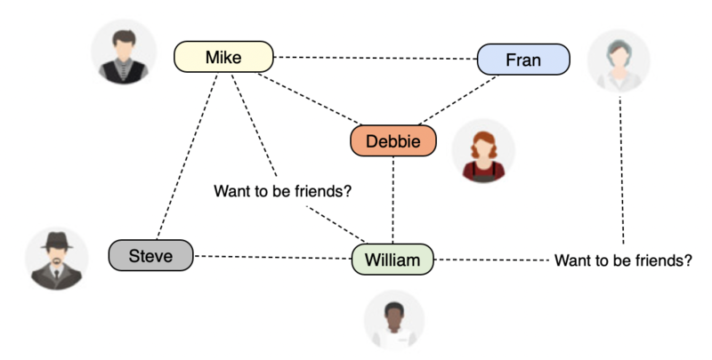

**Now for Janice.**

Janice is on her own node. She invites Tina, who is friends with Steve, on Mike's node. 

Both Steve and Tina can see messages on both nodes, because they have friendships there, and they are already logged into the central server.

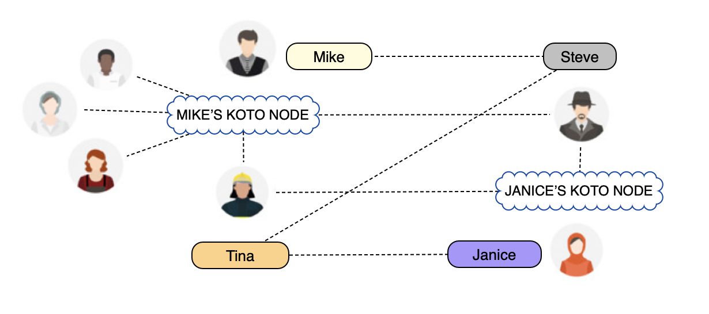

Steve and Tina see messages in one contiguous timeline - again like Facebook. They aren't aware that some messages are from Mike's node, and others are from Janice's node.

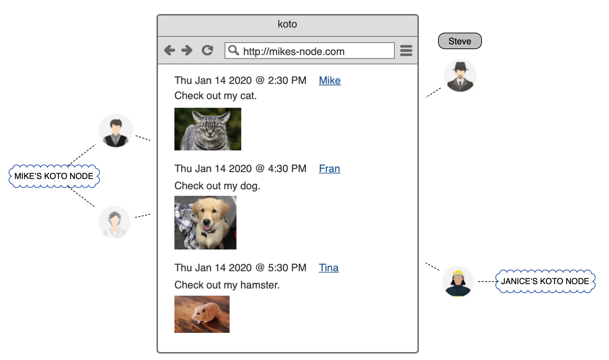

When Tina posts a message, it will go to the node where most of her friends are. At this point she has one friend on each node, so it might end up on either one. As Koto gets more popular, we will change this alogirithm a bit to make sure popular nodes are not overwhelmed.

