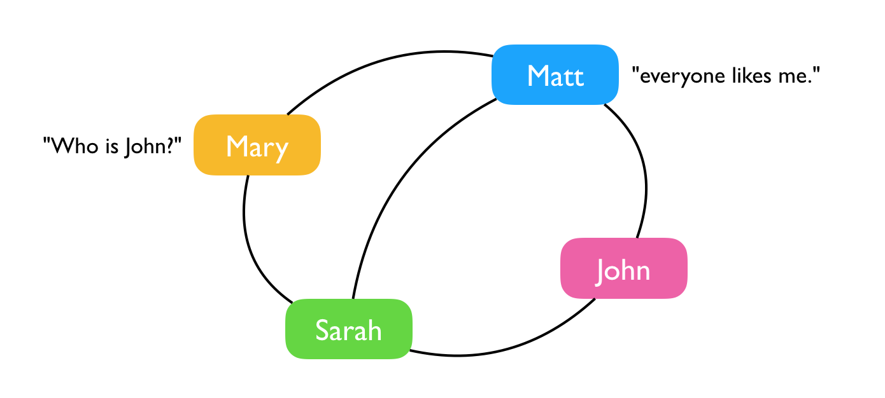
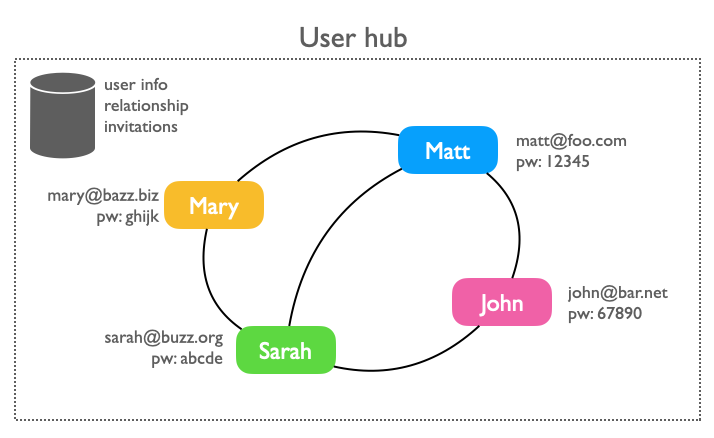
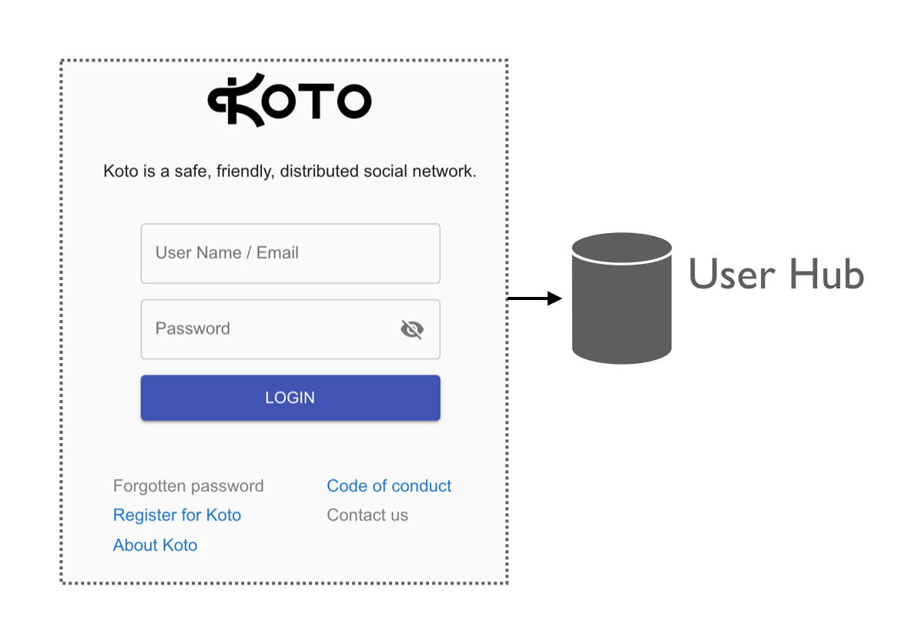
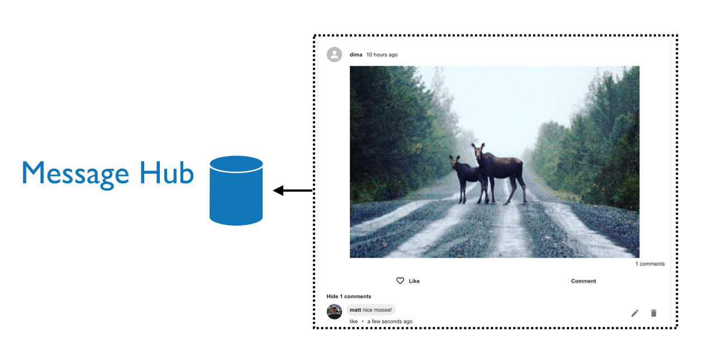

# How it works

Koto is very similar to Facebook (which is a good thing).

Facebook is comprised of a [social graph](https://en.wikipedia.org/wiki/Social_graph) representing relationships between different people. Koto has the same type social graph, giving individuals the ability to accept or ignore friendship requests to limit who view messages in their timeline. Unlike Facebook, it accomplishes this on distributed servers, called "message hubs," owned and operated by individuals, rather than corporations.

### Example social graph

Here's a simple social graph. Everyone has friends, and those friends overlap in different ways, as they do in real life, or middle school.

### The user hub

Information about people, who they are friends with, emails, and passwords, are stored on the koto user hub. It's basically a central database, running at https://koto.at. The "at" is for Austria, which is where Koto's creator, Matt, lives with his wife and kids.

When someone registers, or logs into koto.at, they are accessing the user hub. There's only one hub, and it controls access to the rest of the network, which we will learn about next.

### Message hubs

When someone posts a message, it's stored on a message hub. Message hubs also store pictures and videos too.

Unlike the user hub, which is owned and operated by the koto organization, message hubs are independently owned by users, like you. This is what distinguishes koto from Facebook, and makes it possible to run a network without having to raise millions of dollars or sell advertising.

Today there are only a handful of message hubs, but there is nothing stopping koto from growing to hundreds, or even thousands of message hubs, all over the world.

### Who needs a hub?

Only one hub is needed per group of friends. If you don't have a friend with a hub you'll be stuck with the welcome page instead of reading messages and enjoying photos.

If your friends don't have a hub, and you want to create your own, [follow these instructions](install-message-hub.md).