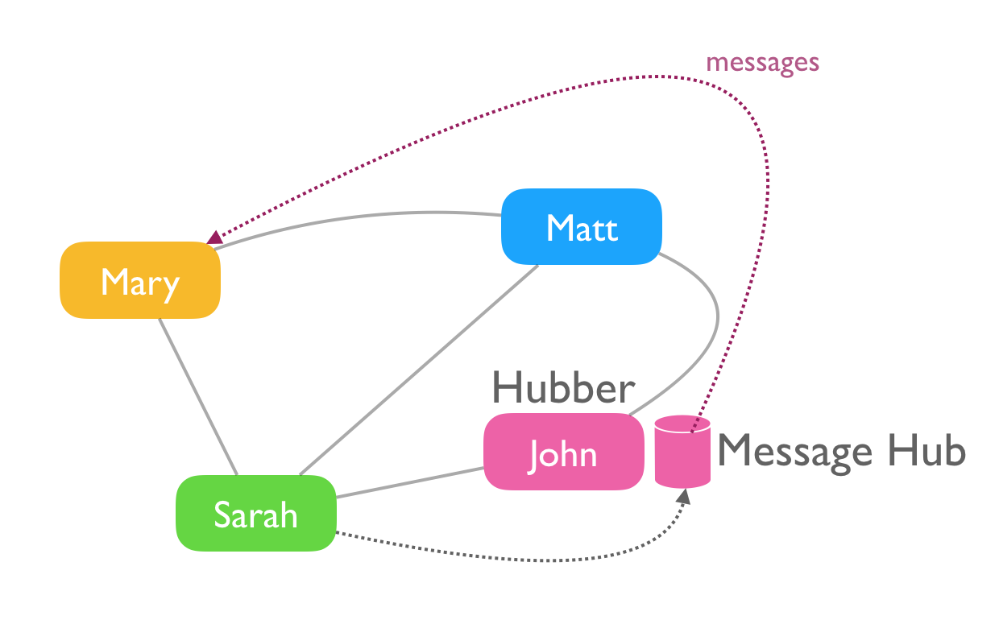

# How it works

It's very similar to Facebook (which is a good thing).

Facebook is comprised of a [social graph](https://en.wikipedia.org/wiki/Social_graph) representing relationships between different people. Koto has the same type social graph, giving individuals the ability to accept or ignore friendship requests to limit who view messages in their timeline. Unlike Facebook, it accomplishes this on distributed servers, called "message hubs," owned and operated by individuals, rather than corporations.

### Example social graph

Here's a simple social graph. Everyone has friends, and those friends overlap in different ways, as they do in real life, or middle school.

### The user hub

Information about people, who they are friends with, emails, and passwords, are stored on the koto user hub. It's basically a central database, running at https://koto.at. The "at" is for Austria, which is where Koto's creator, Matt, lives with his wife and kids.

When someone registers, or logs into koto.at, they are accessing the user hub. There's only one hub, and it controls access to the rest of the network, which we will learn about next.

### Message hubs

When someone posts a message, it's stored on a message hub. Message hubs also store pictures and videos too.

Unlike the user hub, which is owned and operated by the koto organization, message hubs are independently owned by users, like you. This is what distinguishes koto from Facebook, and makes it possible to run a network without having to raise millions of dollars or sell advertising.

Today there are only a handful of message hubs, but there is nothing stopping koto from growing to hundreds, or even thousands of message hubs, all over the world.

### Message hubs are operated by hubbers

People that run message hubs are known as 'hubbers.' These are friendly folks who store messages on behalf of their friends and family. They are a bit technical and understand how to run servers in the cloud. Depending on the provider they use, they spend about $20/month to host your messages. If you run into a hubber, say thanks and buy them a sandwich.

### Everyone needs to know a hubber

You must know a hubber to post messages, photos, or videos. Without a hubber as a friend, you won't be able to read or post messages. Instead of messages, you'll see a message telling you to either (A) connect with a hubber or (B) become one yourself.

Here's what that looks like.

(image of that page coming soon)

### How messages are stored

Now that you understand the difference between user hubs, message hubs, and hubbers, we can explain how messages are stored.

If you have one hubber friend, all your messages will be stored on that friend's message hub. If you have two hubber friends, your messages will be stored with the friend who shares more of your friends.

In the illustration below you can see how messages are stored. Notice that Matt and John's messages are stored on their own hubs.

### How messages are viewed

Messages are viewed in chronological order, just like Facebook. There is no way to know if those messages are stored in one hub, or many. This is the beauty of koto. Things are stored all over planet earth, but there's just one message page, and each message looks the same.

You don't need a hubber friend to view messages - only to post them. So you can still read messages from your friends, and write comments on their posts, even if you lack a hubber pal.

In the illustration below - Mary can read Sarah's messages, because they are friends, even though she is not friends with Mary's hubber, John. Sadly, Mary can't post messages until Matt, Mary, or Sarah becomes a hubber.

### Becoming a hubber

Becoming a hubber is relatively easy for technical folks. Just follow the instructions on the [be a hubber](message-hub-registration.md) page.