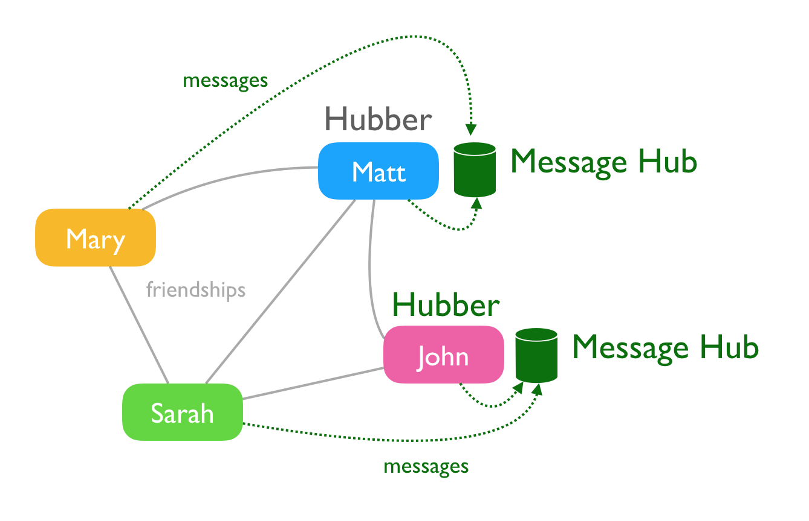

# How it works

Koto is very similar to Facebook (which is a good thing).

Facebook is comprised of a [social graph](https://en.wikipedia.org/wiki/Social_graph) representing relationships between different people. Koto has the same type social graph, giving individuals the ability to accept or ignore friendship requests to limit who view messages in their timeline. Unlike Facebook, it accomplishes this on distributed servers, called "message hubs," owned and operated by individuals, rather than corporations.

### Example social graph

Here's a simple social graph. Everyone has friends, and those friends overlap in different ways, as they do in real life, or middle school.

### The user hub

Information about people, who they are friends with, emails, and passwords, are stored on the koto user hub. It's basically a central database, running at https://koto.at. The "at" is for Austria, which is where Koto's creator, Matt, lives with his wife and kids.

When someone registers, or logs into koto.at, they are accessing the user hub. There's only one hub, and it controls access to the rest of the network, which we will learn about next.

### Message hubs

When someone posts a message, it's stored on a message hub. Message hubs also store pictures and videos too.

Unlike the user hub, which is owned and operated by the koto organization, message hubs are independently owned by users, like you. This is what distinguishes koto from Facebook, and makes it possible to run a network without having to raise millions of dollars or sell advertising.

Today there are only a handful of message hubs, but there is nothing stopping koto from growing to hundreds, or even thousands of message hubs, all over the world.

### Who are the hub runners?

Hub runners are friendly folks that create message hubs. These message hubs store messages, photos, and videos for their friends. Depending on the cloud they use, hub runners will spend about $20/month. If you run into a hub runner - buy them a sandwich and say "thanks."

### Everyone needsa a hub runner friend

You must know a hub runner to post messages, photos, and videos. Without a hub runner friend, you won't be able to use koto at all. Instead of messages, you'll be asked to either (A) connect with a hub runner or (B) become one yourself.

Here's what that looks like.

(image of that page coming soon)

### How messages are stored

Now that you understand the difference between user hubs and message hubs we can explain how messages are stored.

If you are friends with a hub runner, all your messages will be stored on their message hub. If you are friends with two hub runners, your messages will be stored with on the hub with the most common friends.

The illustration below shows how messages are stored. Notice Matt and John's messages are stored on their own hubs.

### How messages are viewed

Messages are viewed in chronological order, just like Facebook. These messages could be stored all over planet earth, but there's only one message page. It's unnecsessary to know which message is stored where. Users don't care.

You don't need a hub runner friend to view messages - only to post them. So you can read your friend's messages, and write comments, even if you lack a hub runner friend.

In the illustration below - Mary can read Sarah's messages, because they are friends, even though she is not friends with Mary's hub runner, John. Sadly, Mary can't post messages until Matt, Mary, or Sarah decide to run a hub themselves.

### Becoming a hub runner

Becoming a hub runner is relatively easy for technical folks. Just follow the instructions on the [run a hub](message-hub-registration.md) page.