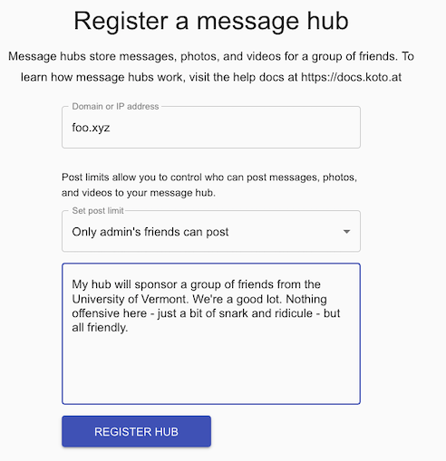

# Creating a message hub

## Intro

The Koto network is made up of different message hubs, each owned and operated by individual members. Message hubs store messages, photos, and videos for groups of friends.

If you don't have any hub-enabled friends on the Koto network, you will see the "No Hub" cat, letting you know there's no message hub in your group, so you can't post messages.


If you want to get rid of the cat, for you and your friends, someone in the group needs to create a message hub. Creating a hub is pretty easy. You can do it on any hosting provider or cloud.

If you don't understand, or don't want to set up a message hub, just find a friend who does. Again, one friend, with one hub, is all the group needs.

The instructions below explain how to get a message hub running on Digital Ocean, which is the least evil of the big clouds, and only costs $5 a month.

Since Koto uses encryption, you'll start by purchasing a domain name for a few dollars. The instructions show how to do this at [https://namecheap.com](https://namecheap.com).

## Buy a domain name

Koto uses encryption, which won't work unless you purchase a domain name. Search for a domain at [https://namecheap.com](https://namecheap.com). Your friends won't type this domain into their browser so don't waste your money on anything special. ".xyz" and ".space" domains are usually a few dollars a year. 

## Sign up for Digital Ocean

If you don't have a Digital Ocean account you can sign up for one [here](https://cloud.digitalocean.com/registrations/new).

## Create a Droplet

Now that you're signed up it's time to create a Droplet. Droplets are just Linux servers with cute names.

1. [Login to Digital Ocean](https://cloud.digitalocean.com/login)
2. Click the Create button and choose `Droplet` (or click [here](https://cloud.digitalocean.com/droplets/new))
3. Choose the following options for your Droplet:
   **Image:** Ubuntu
   **Plan:** Shared CPU for $5/month
   **Datacenter region:** (choose the datacenter that is closest your friends)
   **Authentication:** Password
   **Create root password:** (unique password saved to your password manager)
   **Choose a hostname:** koto-message-hub
   **Enable backups:** Check this option ($1.00 extra) if you want backups
4. Wait for the new Droplet to appear
5. Copy the Droplet's IP address

## Point NameCheap nameservers to Digital Ocean

1. Login to [https://namecheap.com](https://namecheap.com) again
2. Go to **Domain List** and find the domain you purchased
3. Click **Manage**
4. In the **Name Servers** section select **Custom DNS**
5. Enter the following nameservers to point at Digital Ocean:
    ns1.digitalocean.com
    ns2.digitalocean.com
    ns3.digitalocean.com
6. Click the green checkmark to apply your changes

## Create DNS records for your domain

1. [Login to Digital Ocean](https://cloud.digitalocean.com/login)
2. Click the Create button and choose `Domains/DNS` (or click [here](https://cloud.digitalocean.com/networking/domains))
3. Enter the domain name you registered (example: foo.xyz)
4. The name of your Droplet should appear in the box to right
5. Click **Add Domain*
6. Create a new 'A' record with the following settings:
    **Hostname:** @
    **Will Direct To:** (replace with your droplet's IP address)
    **TTL:** 3600
7. Click **Create Record**

## Create a Digital Ocean Space

You need a Digital Ocean Space to store phots and videos.

1. [Login to Digital Ocean](https://cloud.digitalocean.com/login)
2. Click the Create button and choose `Spaces` (or click [here](hhttps://cloud.digitalocean.com/spaces/new))
3. Choose the same datacenter region as your droplet
4. Do not enable CDN nor file listing
5. Choose a subdomain (ex: koto-your-name)
6. Click **Create Space**
7. Click the **Settings** tab
8. Scroll to the Endpoint section and copy the endpoint address
9. Go to the API tokens page [here](https://cloud.digitalocean.com/account/api/tokens)
10. Scroll down to the **Spaces access keys** section
11. Click **Generate New Key**
12. Name the key something similar to your domain (ex: foo)
13. Copy the key and secret to your password manager

## Install Docker and Koto on your Droplet

1. Open a terminal session
2. SSH into your instance using the Droplet's IP address
`ssh root@(replace with your droplet's IP address)`
3. Install Docker Engine (be patient - the update takes a minute)
```
sudo apt-get update
sudo snap install docker
```
4. Install Docker Compose
```
sudo curl -L "https://github.com/docker/compose/releases/download/1.27.4/docker-compose-$(uname -s)-$(uname -m)" -o /usr/local/bin/docker-compose
sudo chmod +x /usr/local/bin/docker-compose
```
5. Create a new directory and go into it
```
mkdir ~/koto-hub
cd ~/koto-hub
```
4. Download Koto's docker-compose and environment templates:
```
curl https://raw.githubusercontent.com/mreider/koto/master/docker/message-hub/docker-compose.yml -O
curl https://raw.githubusercontent.com/mreider/koto/master/docker/message-hub/.env.template -O
```
5. Copy the environment template to `.env`:
```
cp .env.template .env
```

## Configure Koto

1. Open your environment file in a text editor
```
nano .env
```
2. Modify the file as follows:
```
KOTO_EXTERNAL_ADDRESS=https://(replace with your domain name - ex: foo.xyz)
KOTO_USER_HUB_ADDRESS=https://central.koto.at
KOTO_DB_NAME=koto-message-hub
KOTO_DB_USER=postgres
KOTO_DB_PASSWORD=(make up a random password)
KOTO_S3_ENDPOINT=(replace with the space endpoint address you copied)
KOTO_S3_REGION=
KOTO_S3_KEY=(replace with the space secret you created)
KOTO_S3_SECRET=(replace with the space secret you created)
KOTO_S3_BUCKET=(replace w/ your space name - ex: koto-your-name)
VOLUME_HUB=/root/db/hub
VOLUME_DB=/root/db
```

## Start the message hub and db containers

```
docker-compose pull
docker-compose up -d
```

## Setup Caddy

Caddy is a web server that features encryption using Let's Encrypt. Now we'll set up and configure Caddy to use it for your new message hub.

1. Install Caddy
```
echo "deb [trusted=yes] https://apt.fury.io/caddy/ /" | sudo tee -a /etc/apt/sources.list.d/caddy-fury.list
sudo apt update
sudo apt install caddy
```
2. Open `/etc/caddy/Caddyfile` in a text editor:
`sudo nano /etc/caddy/Caddyfile` 
3. Delete the contents of the file and replace as follows (replace foo.xyz with your domain):
```
foo.xyz

route {
  reverse_proxy localhost:12001
}
```
3 Reload Caddy configuration
`sudo systemctl reload caddy`

## Register the hub

The setup of your message hub is complete. The last step is to register the hub with Koto.

1. Login to Koto
2. Choose **Message Hubs** from the menu
3. Enter your message hub information.



The Koto central admin will receive a notification of your request and approve it within 10-12 hours.

# Updating your message hub

Koto message hub versions are updated relatively frequently. To update your hub
to the latest version, follow these directions:

1. SSH into your message hub and change directories
```
ssh root@(replace with your droplet's IP address or domain)
cd ~/koto-hub
```
2. Download new docker compose and environment templates
```
curl https://raw.githubusercontent.com/mreider/koto/master/docker/message-hub/docker-compose.yml -O
curl https://raw.githubusercontent.com/mreider/koto/master/docker/message-hub/.env.template -O
```
3. Read the release notes, look over the template for new parameters, and modify your .env file if needed
4. Rebuild your containers
5. If you see warnings (like `WARNING: The KOTO_NEW_THING variable is not set. Defaulting to a blank string.`), edit .env file (`nano .env`) and set values for new variables.
6. Restart hub and db containers
```
docker-compose pull
docker-compose up -d
```
