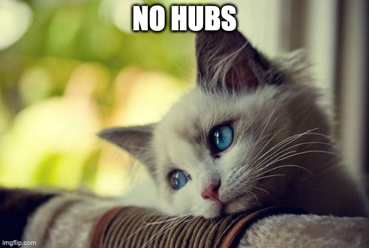
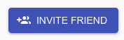
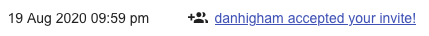
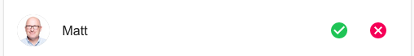

# User's guide

**Aug 2020 update**: Koto is in alpha. If you find a bug, file it [here](https://github.com/mreider/koto/issues). Also, please donate [here](https://gf.me/u/x738p6)! I've raised $2k, spent $4k, and my wife is grumpy (and lovely).

## Register an account

1. Visit [https://koto.at](https://koto.at) and click **Register**.
2. Enter a user name, email, and password
3. Check your inbox for a confirmation email and click on the link
4. Login using the information you provided

##  No hubs

If you see the **No Hubs** kitty it means there is no place to store messages. Koto is an ad-free, distributed social network, and unlike Facebook we don't make any money. So everyone needs their own hub.

You have two choices for getting a message hub:

1. Connect with a hub runner friend
2. Create your own hub

### Connect with a hub runner friend

Email your friends and see if they have a message hub. If they do, click the Invite Friends button and send them an invitation. Hopefully, next time you visit Koto, you will see some messages, instead of the No Hubs kitty.

### Create a hub

Creating a hub requires some technical expertise and a cloud account on Digital Ocean, Google, Amazon, or wherever. First, install the hub using [these instructions](install-message-hub.md). Then register the hub [here](message-hub-registration.md).

**Note:** In this alpha phase you can use my hub - so just send me a friend request (type 'matt' instead of an email) Or, create your own if you want to experiment.

## Inviting friends

1. Go to the menu and choose **friends**
2. Choose the **invite friend** button
3. Enter your friend's email address
4. Your friend will get an email and accept the invitation
5. You should see a notification (menu > notifications) they accepted
6. You should see them on your friends page

## Accepting an invitation

1. After getting an email invitation click the link
2. Go to the friends page and choose **Invites**
3. Accept the invitation
4. Visit the messages page and see if your friend posted anything!

## Messages

### Privacy

Koto's messages work like Facebook:

1. You will only see friend's messages
2. Your messges will only be seen by your friends

Comments underneath a message work a little differently. Again, this is how Facebook works as well, so you should be used to it:

1. You may see comments under a friend's message from people you do not know
2. If you post a comment under a friend's message - it will be seen by people you don't know

So. If you don't want anyone to ever see your profile picture, or anything about you, don't make any comments under a friend's message. 

**Note:** If you want to request different privacy features, go [here](https://github.com/mreider/koto/issues), and also donate [here](https://gf.me/u/x738p6) to help support the cause.

### Formatting

Koto supports Markdown for formatting messages. You can see how that works [here](https://devhints.io/markdown). This is also a nice trick if you want to post more than one image.

## Friends of friends

You can see who your friends are connected to, and ask for new friends, as follows:

1. Visit the **Friends** page
2. Choose a friend
3. You will see a list of their friends
4. Click the friend icon on the right of their name
5. After they accept you'll see them in your list

